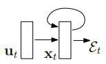
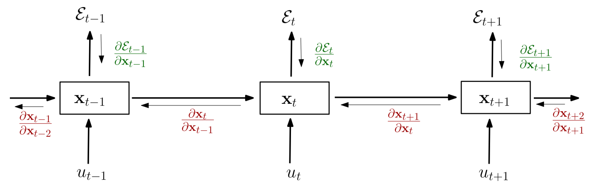

# 关于训练循环神经网络的困难性

## 基本信息

### 作者

| 姓名               | 单位                   | 电子邮件                   |
| ------------------ | ---------------------- | -------------------------- |
| **Razvan Pascanu** | Universite de Montreal | pascanur@iro.umontreal.ca  |
| **Tomas Mikolov**  | Brno University        | t.mikolov@gmail.com        |
| **Yoshua Bengio**  | Universite de Montreal | yoshua.bengio@umontreal.ca |

### 引用

| 项目         | 文本                                  |
| ------------ | ------------------------------------- |
| arXiv 标识符 | arXiv:1211.5063v2 [cs.LG] 16 Feb 2013 |

## 摘要

在正确训练循环神经网络时会面临两个众所周知问题，即 Bengio 等人（1994 年）详细介绍的梯度消失问题和梯度爆炸问题。在本文中，我们试图通过从分析学、几何学和动力系统的角度探讨这些问题来提高对潜在问题的理解。我们的分析被用来验证一个简单而有效的解决方案。本文提出了一种处理梯度爆炸的范数剪切策略和处理梯度消失问题的软约束方法，并在实验部分验证了我们的假设和提出的解决方案。

## 1. 介绍

循环神经网络（RNN，如图 1）是 80 年代提出的一种为时间序列建模而生的神经网络模型（Rumelhart 等人，1986 年；Elman，1990 年；Werbos，1988 年）。该网络的结构类似于标准的多层感知器，区别在于我们允许与时间延迟相关联的隐藏层之间的连接。通过这些连接，该模型可以保留关于过去输入的信息，使其能够发现数据中可能彼此相距遥远的事件之间的时间相关性（这是正确学习时间序列的一个关键属性）。虽然原则上循环神经网络是一个简单而强大的模型，但实践中很难进行正确的训练。这个模型显得笨拙的主要原因之一是梯度消失以及梯度爆炸问题（Bengio 等人，1994）。

图1：一个循环神经网络的示意图。隐藏层的循环连接允许信息从一个输入持续保存到另一个输入。

### 1.1 训练神经网络

考虑一个生成式循环神经网络，输入为 $u_t$，在时间阶段 $t$ 时的状态为 $x_t$（如方程 $\eqref{1}$）。在本文中的理论部分，为了提供条件更精准、更符合直觉的日常用例，我们有时会使用方程 $\eqref{11}$ 给出的特殊参数化。

$$
\begin{equation}\label{1}
	x_t = F(x_{t-1}, u_t, \theta)
\end{equation}
$$

$$
\begin{equation}\label{2}
	x_t = W_{rec}\sigma(x_{t-1})+W_{in}u_t+b
\end{equation}
$$

模型参数由权重矩阵 $W_{rec}$、偏差值 $b$ 和输入矩阵 $W_{in}$ 给出，其中 $W_{in}$ 一般整理为 $\theta$。$x_0$ 由用户给出，设置为 0 或由学习得到，$\sigma$ 是一个逐元素操作函数（通常为 $tanh$ 或 $sigmoid$ 函数）。代价 $\epsilon$ 衡量网络在特定任务上的表现，可以被拆分为每一步独立的代价 $\epsilon = \sum_{1\leq t\leq T}\epsilon_t$，其中 $\epsilon_t = \mathcal{L}(x_t)$。

一种计算必要梯度的方法为时域反向传播（BPTT），具体来说，循环模型表示为一个深的多层结构（并包含一个无范围限制的数目层），反向传播应用于展开模型上（如图 2）

图 2：通过为每个时间步长创建一个模型的副本，及时展开递归神经网络。我们使用 $x_t$ 表示网络在 $t$ 时刻的隐藏状态，用 $u_t$ 表示时间 $t$ 时网络的输入，用 $\epsilon_t$ 表示截止 $t$ 时刻的累计误差。

在这一点上我们将偏离经典的 BPTT 方程，并重写梯度（见方程 $\eqref{3}$、$\eqref{4}$ 和 $\eqref{5}$）以更好地突出梯度爆炸问题。这些方程通过将梯度以元素之和的形式写出而得到。

$$
\begin{equation}\label{3}
	\frac{\part\epsilon}{\part\theta}=\sum_{1\leq t\leq T}\frac{\part \epsilon_t}{\part\theta}
\end{equation}
$$

$$
\begin{equation}\label{4}
	\frac{\part\epsilon_t}{\part\theta}=\sum_{1\leq k\leq t}(\frac{\part\epsilon_t}{\part x_t}\frac{\part x_t}{\part x_k}\frac{\part^+x_k}{\part\theta})
\end{equation}
$$

$$
\begin{equation}\label{5}
	\frac{\part x_t}{\part x_k}=\prod_{t\geq i>k}\frac{\part x_i}{\part x_{i-1}}=\prod_{t\geq i>k}W^T_{rec}diag(\sigma'(x_{i-1}))
\end{equation}
$$

$\frac{\part^+x_k}{\part\theta}$ 表示状态 $x_k$ 关于 $\theta$ “立刻的”偏微分，换句话说，$x_{k-1}$ 被当作关于 $\theta$ 的常函数。特别地，考虑方程 $\eqref{2}$，任何第 $i$ 行的矩阵 $\frac{\part^+x_k}{\part W_{rec}}$ 仅仅是 $\sigma(x_{k-1})$。方程 $\eqref{5}$ 也为方程 $\eqref{11}$ 的参数化提供了 Jacobi 矩阵 $\frac{\part x_i}{\part x_{i-1}}$ 的形式，$\sigma '$ 以逐元素的形式计算了 $\sigma$ 的微分。

## 2. 梯度爆炸和梯度消失

### 2.1 机制

### 2.2 绘制动态系统的相似性

### 2.3 几何解释

## 3. 梯度爆炸和梯度消失的处理

### 3.1 先前的方案

### 3.2 梯度下降

### 3.3 梯度消失的正规化

## 4. 实验与结果

### 4.1 病态合成问题

#### 4.1.1 时间序列问题

#### 4.1.2 其它病理性任务

### 4.2 自然问题

## 5. 总结和结论

## 致谢

我们也要感谢西奥诺开发团队（特别是弗雷德里克·巴斯蒂安，帕斯卡尔·兰布林和詹姆斯·伯格斯特拉）的帮助。我们感谢NSERC，FQRNT，CIFAR，RQCHP和计算加拿大为他们提供的资源。
