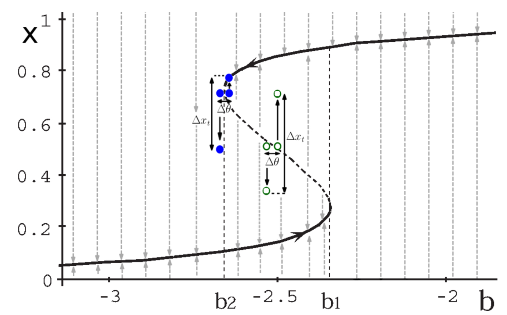
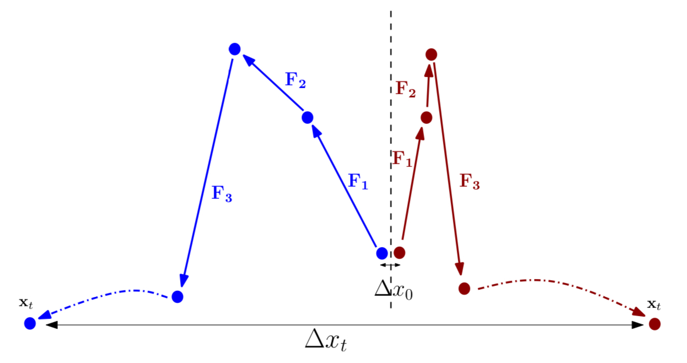
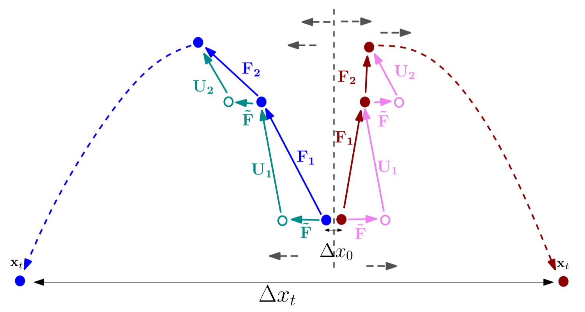
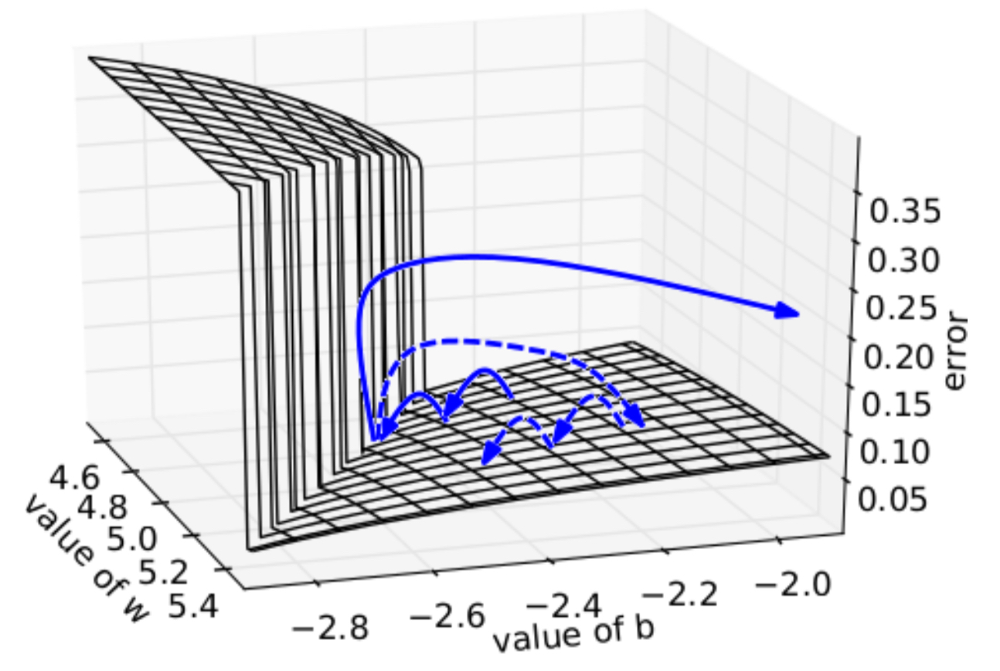
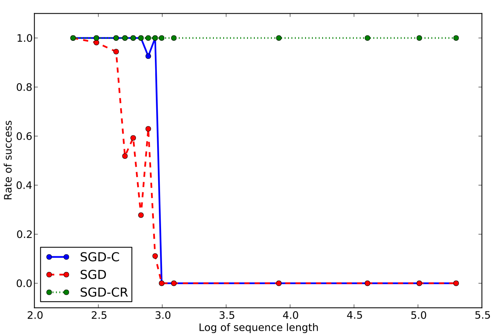

# 关于训练循环神经网络的困难性

## 基本信息

### 作者

| 姓名               | 单位                   | 电子邮件                   |
| ------------------ | ---------------------- | -------------------------- |
| **Razvan Pascanu** | Universite de Montreal | pascanur@iro.umontreal.ca  |
| **Tomas Mikolov**  | Brno University        | t.mikolov@gmail.com        |
| **Yoshua Bengio**  | Universite de Montreal | yoshua.bengio@umontreal.ca |

### 引用

| 项目         | 文本                                  |
| ------------ | ------------------------------------- |
| arXiv 标识符 | arXiv:1211.5063v2 [cs.LG] 16 Feb 2013 |

## 摘要

在正确训练循环神经网络时会面临两个众所周知问题，即 Bengio 等人（1994 年）详细介绍的梯度消失问题和梯度爆炸问题。在本文中，我们试图通过从分析学、几何学和动力系统的角度探讨这些问题来提高对潜在问题的理解。我们的分析被用来验证一个简单而有效的解决方案。本文提出了一种处理梯度爆炸的范数剪切策略和处理梯度消失问题的软约束方法，并在实验部分验证了我们的假设和提出的解决方案。

## 1. 介绍

循环神经网络（RNN，如图 1）是 80 年代提出的一种为时间序列建模而生的神经网络模型（Rumelhart 等人，1986 年；Elman，1990 年；Werbos，1988 年）。该网络的结构类似于标准的多层感知器，区别在于我们允许与时间延迟相关联的隐藏层之间的连接。通过这些连接，该模型可以保留关于过去输入的信息，使其能够发现数据中可能彼此相距遥远的事件之间的时间相关性（这是正确学习时间序列的一个关键属性）。虽然原则上循环神经网络是一个简单而强大的模型，但实践中很难进行正确的训练。这个模型显得笨拙的主要原因之一是梯度消失以及梯度爆炸问题（Bengio 等人，1994）。

图1：一个循环神经网络的示意图。隐藏层的循环连接允许信息从一个输入持续保存到另一个输入。

### 1.1 训练神经网络

考虑一个生成式循环神经网络，输入为 $u_t$，在时间阶段 $t$ 时的状态为 $x_t$（如方程 $\eqref{1}$）。在本文中的理论部分，为了提供条件更精准、更符合直觉的日常用例，我们有时会使用方程 $\eqref{11}$ 给出的特殊参数化。

$$
\begin{equation}\label{1}
	x_t = F(x_{t-1}, u_t, \theta)
\end{equation}
$$

$$
\begin{equation}\label{2}
	x_t = W_{rec}\sigma(x_{t-1})+W_{in}u_t+b
\end{equation}
$$

模型参数由权重矩阵 $W_{rec}$、偏差值 $b$ 和输入矩阵 $W_{in}$ 给出，其中 $W_{in}$ 一般整理为 $\theta$。$x_0$ 由用户给出，设置为 0 或由学习得到，$\sigma$ 是一个逐元素操作函数（通常为 $tanh$ 或 $sigmoid$ 函数）。代价 $\epsilon$ 衡量网络在特定任务上的表现，可以被拆分为每一步独立的代价 $\epsilon = \sum_{1\leq t\leq T}\epsilon_t$，其中 $\epsilon_t = \mathcal{L}(x_t)$。

一种计算必要梯度的方法为时域反向传播（BPTT），具体来说，循环模型表示为一个深的多层结构（并包含一个无范围限制的数目层），反向传播应用于展开模型上（如图 2）

图 2：通过为每个时间步长创建一个模型的副本，及时展开递归神经网络。我们使用 $x_t$ 表示网络在 $t$ 时刻的隐藏状态，用 $u_t$ 表示时间 $t$ 时网络的输入，用 $\epsilon_t$ 表示截止 $t$ 时刻的累计误差。

在这一点上我们将偏离经典的 BPTT 方程，并重写梯度（见方程 $\eqref{3}$、$\eqref{4}$ 和 $\eqref{5}$）以更好地突出梯度爆炸问题。这些方程通过将梯度以元素之和的形式写出而得到。

$$
\begin{equation}\label{3}
	\frac{\part\epsilon}{\part\theta}=\sum_{1\leq t\leq T}\frac{\part \epsilon_t}{\part\theta}
\end{equation}
$$

$$
\begin{equation}\label{4}
	\frac{\part\epsilon_t}{\part\theta}=\sum_{1\leq k\leq t}(\frac{\part\epsilon_t}{\part x_t}\frac{\part x_t}{\part x_k}\frac{\part^+x_k}{\part\theta})
\end{equation}
$$

$$
\begin{equation}\label{5}
	\frac{\part x_t}{\part x_k}=\prod_{t\geq i>k}\frac{\part x_i}{\part x_{i-1}}=\prod_{t\geq i>k}W^T_{rec}diag(\sigma'(x_{i-1}))
\end{equation}
$$

$\frac{\part^+x_k}{\part\theta}$ 表示状态 $x_k$ 关于 $\theta$ “立刻的”偏微分，换句话说，$x_{k-1}$ 被当作关于 $\theta$ 的常函数。特别地，考虑方程 $\eqref{2}$，任何第 $i$ 行的矩阵 $\frac{\part^+x_k}{\part W_{rec}}$ 仅仅是 $\sigma(x_{k-1})$。方程 $\eqref{5}$ 也为方程 $\eqref{11}$ 的参数化提供了 Jacobi 矩阵 $\frac{\part x_i}{\part x_{i-1}}$ 的形式，$\sigma '$ 以逐元素的形式计算了 $\sigma$​ 的微分。

注意到 $\eqref{3}$ 中的每一个 $\frac{\part\epsilon_t}{\part\theta}$ 都是形式相同的和式，这些单独项的行为决定了和式的行为。因此之后我们主要关注这样的一个通用术语，在不会引起歧义的情况下将其简单地称为“梯度”。

任何梯度元素 $\frac{\part\epsilon_t}{\part\theta}$ 也是一个和式（如方程 $\eqref{4}$），我们将其称为时间贡献或时间分量。可以看到，每一个这样的时间贡献 $\frac{\part\epsilon_t}{\part x_t}\frac{\part x_t}{\part x_k}\frac{\part^+x_k}{\part\theta}$ 测量了 $\theta$ 在第 $k$ 步如何影响之后的第 $t>k$ 步。因子 $\frac{\part x_t}{\part x_k}$（方程 $\eqref{5}$）及时传递了 $t$ 时刻第误差至第 $k$ 步。我们可以进一步宽松地区分长期和短期的贡献值，其中“长期”指 $k\ll t$，“短期”指其它。

## 2. 梯度爆炸和梯度消失

如 Bengio 所介绍（1994 年），“梯度爆炸”的问题指的是训练时梯度的范数过大增长。这样的问题由长期的元素指数级别大小“爆炸”导致。“梯度消失”则是指相反的情况——元素长期以指数级别速度趋近于零，从而导致模型几乎无法学习时间跨度遥远的事件之间的相关性。

### 2.1 机制

为了理解这一现象，我们需要观察每个时间分量的形式，特别是以 $t-k$ Jacobi 矩阵乘积形式存在的矩阵因子 $\frac{\part x_t}{\part x_k}$（见方程 $\eqref{5}$）。同样地，$t-k$​ 实数的乘积可以收缩到零或爆炸到无穷大，这个矩阵也会。

接下来我们需要尝试将这些直觉形式化（扩展 Bengio 等人在论文中所做的类似推导（1994 年），在论文中他们只考虑了一元情况）

如果我们考虑这个模型的一个线性版本（如方程 $\eqref{11}$ 中将 $\sigma$ 代入特征方程），可以使用幂迭代法正式分析 Jacobi 矩阵的乘积，得到梯度爆炸的严格条件（这些条件的详细推导见补充材料）。对于循环权重矩阵的最大特征值 $\lambda_1$ 而言，只要其小于 $1$，长期分量就会消失（随着 $t\to\infin$），而要使梯度爆炸，必须确保它大于 $1$​。

我们可以将这些结果推广到非线性函数 $\sigma$，其中 $\sigma$ 的绝对值 $\sigma '(x)$ 是有界的（不妨设 $\gamma\in\mathbb{R}$ 为上确界），从而有 $\|diag(\theta '(x_k))\|\leq\gamma$​。

我们首先证明 $\lambda_1<\frac{1}{\gamma}$ 是充分的条件，事实上，这时候 $\lambda_1$ 是能够出现梯度消失问题的循环权重矩阵 $W_{rec}$ 最大的特征值。注意到我们假设了 $\eqref{11}$ 的参数化。Jacobi 矩阵 $\frac{\part x_{k+1}}{\part x_k}$ 由 $W_{rec}^T diag(\sigma '(x_k))$ 给出。这个 Jacobi 矩阵的 2-范数范围被两个矩阵的范数限制（方程 $\eqref{6}$）。由于我们的假设，这推出它比 $1$ 小。

$$
\begin{equation}\label{6}
	\forall k, \|\frac{\part x_{k+1}}{\part x_k}\|\leq\|W_{rec}^T\|\|diag(\sigma '(x_k))\|<\frac{1}{\gamma}\gamma<1
\end{equation}
$$

令 $\eta\in\mathbb{R}$ 使得 $\forall k, \|\frac{\part x_{k+1}}{\part x_k}\|\leq\eta<1$，$\eta$ 的存在性由方程 $\eqref{6}$ 给出，通过变换 $i$ 的值，我们发现

$$
\begin{equation}\label{7}
	\frac{\part\epsilon_t}{\part x_t}(\prod_{i=k}^{t-1}\frac{\part x_{i+1}}{\part x_i})\leq\eta^{t-k}\frac{\part\epsilon_t}{\part x_t}
\end{equation}
$$

因为 $\eta<1$，因此根据 $\eqref{7}$，长期贡献（即 $t-k$ 较大）以指数级别趋近于零。

通过引入这个证明，我们得到了梯度爆炸的必要条件，也就是最大特征值 $\lambda_1$ 比 $\frac{1}{\gamma}$ 大（否则长期数值不会爆炸，而是逐渐消失）。对于 $tanh$ 函数，我们有 $\gamma = 1$；对于 $sigmoid$ 函数，我们有 $\gamma = \frac{1}{4}$。

### 2.2 绘制动态系统的相似性

我们可以通过动态系统的视角来进一步理解梯度爆炸和梯度消失问题，就像之前 Doya（1993 年），Bengio等人（1993 年）所做的工作。

我们建议阅读 Strogatz（1994 年）对动力系统理论的正式且详细的处理。对于任何参数分配，取决于初始状态 $x_0$ 和 状态 $x_t$，在映射 $F$ 的重复应用下，自治动态系统收敛到几种可能吸引子状态之一（如点吸引子，尽管存在其他类型的吸引子）。该模型也可以在混沌状态下运行，在这种情况下，下面的一些观察结果可能不成立，但在这里没有深入讨论。吸引子描述了模型的渐近行为。状态空间被划分为吸引盆地，每个吸引子一个。如果模型在一个吸引盆地中启动，则随着 $t$ 的增长，模型将收敛到相应的吸引子。

动力系统理论告诉我们，随着变化的缓慢，渐近行为几乎在任何地方都平滑地变化，除了某些发生剧烈变化的关键点（新的渐近行为在拓扑上不再与旧的等价）。这些点被称为分岔边界，它们是由出现、消失或改变形状的吸引子引起的。

Doya（1993 年）假设这种分叉交叉可能会导致梯度爆炸。我们想将这一观察结果扩展到梯度爆炸的一个合理条件，因此，我们将重复使用 Doya（1993 年）的单隐藏单元模型（如图 3）

$x$ 轴表示参数 $b$，$y$ 轴表示渐近状态 $x_\infin$。粗体线跟随着点吸引子 $x_\infin$ 移动，随 $b$ 变化。在 $b_1$ 我们有一个分岔边界，其中一个新的吸引子出现（当 $b$ 从 $1$ 减小），而在 $b_2$ 我们还有另一个方法，它会导致这两个吸引子之一的消失。在间隔 $(b_1, b_2)$ 我们处于一个丰富的状态，其中有两个吸引子，它们之间的边界位置的变化，当 $b$ 变化，用虚线追踪出来。向量场（灰色虚线箭头）描述了在该区域初始化网络时状态 $x$ 的演化。

图 3：单个隐藏单元 RNN 的分叉图（混合循环权重为 5.0，可调偏差 $b$，为 Doya（1993 年）介绍的例子），参见文本

我们证明了有两种类型的事件可能导致 $x_t$ 随着 $t\to\infin$ 的大变化。一个是跨越吸引盆地之间的边界（用未填充的圆表示），而另一个是跨越分叉边界（未填充的圆）。对于大的 $t$，$x_t$ 即使 $b$ 的变化很小（因为 $b$ 的变化也会被不同的吸引子吸引），这也会导致很大的梯度。然而，要使梯度爆炸，既没有必要也不可能跨越一个分岔，因为分岔是不可能在局部没有缺陷的全局事件。学习在参数状态空间中追踪出一条路径。如果我们在一个分岔边界，但模型的状态是这样的，它在一个吸引子的吸引盆地，当分叉交叉时不会改变形状或消失，那么这个分岔将不会影响学习。

跨越吸引盆地之间的边界是一个局部事件，而梯度的爆炸是必然的。 如果我们假设跨越到一个新兴吸引子或从一个消失（由于分支）符合穿越一些吸引子之间的边界，我们可以制定一个可靠的条件梯度爆炸封装的观察 Doya（1993 年），扩展也正常跨越不同盆地之间的边界的吸引力。 注意，在图 4 中，只有两个具有分叉的 $b$​ 值，但有一个整个范围的值可以有一个边界交叉。先前分析的另一个局限性是，它们只考虑自治系统，并假设观察结果适用于输入驱动的模型。在 Bengio 等人（1994 年）中通过假设输入是有界噪声来处理它。这种方法的缺点是，它限制了人们对输入的推理方式。在实践中，输入应该驱动动力系统，能够使模型处于某种吸引子状态，或者在某些触发模式出现时，将其踢出吸引盆地。

我们建议通过将输入折叠到地图中，将我们的分析扩展到输入驱动模型。我们考虑映射F的族t，其中我们应用了一个不同的 $F_t$ 在每一步。直观地说，为了使梯度爆炸，我们需要与之前相同的行为，其中（至少在某个方向上）映射 $F_1, F_2, ..., F_t$ 同意并改变方向。图 4 描述了这种行为。

图 4：这个折线图预测了 $x_t$ 的变化，即 $\Delta x_t$ 可能会产生于一个值较小的 $\Delta x_0$。蓝色与红色（左边和右边）的对比由相同的映射 $F_1, F_2, ...$​ 产生，不同之处仅在于初始状态。

对于方程 $\eqref{11}$ 提供的特殊参数化，我们可以通过分解映射 $F$ 为修正映射 $\widetilde{F}$ 和随时间变化的量 $U_t$ 来进一步进行类比。$F(x)=W_{rec}\sigma(x)+b$ 表示一个无输入的循环神经网络，$U_t(x) = x+W_{in}u_t$ 描述了输入造成的影响。这由图 5 展示。既然 $U_t$ 随着时间改变，它不能用于分析标准动力系统的工具，但 $\widetilde{F}$ 可以。这说明当一个盆地之间的边界被 $\widetilde{F}$ 跨越时，状态会向着一个不同的吸引子前进，使得较大的 $t$ 可能导致 $x_t$ 的较大差异（除非输入的映射 $U_t$ 与之相反）。因此研究 $\widetilde{F}$ 的渐进行为可以提供关于此事件发生地点的有用信息。

图 5：描述如何分解 $F_1, ..., F_t$ 为一个常值映射 $\widetilde{F}$ 和映射 $U_1, U_2, ..., U_t$。这个虚竖线代表盆地喜好之间的边界，直虚箭头在边界上指向 $\widetilde{F}$​ 映射的方向，这个图像是图 4 的扩展。

从动力学系统的角度来看，关于消失的梯度的一个有趣的观察结果如下。如果因子 $\frac{\part x_1}{\part x_k}$ 趋于零（对于 $t-k$ 很大），这
意味着 $x_t$ 不依赖于 $x_k$ （如果我们改变 $x_k$ 一些的 $\Delta$，$x_t$ 保持不变）。这就转化为 $x_t$ 处的模型接近收敛到某个吸引子（它将从 $x_k$ 附近的任何地方到达）。

### 2.3 几何解释

让我们考虑一个简单的单隐单元模型（方程 $\eqref{8}$），其中我们提供了一个初始状态 $x_0$​ 并训练模型在 50 步后得到一
个特定的目标值。请注意，为了简单起见，我们假设没有输入。

$$
\begin{equation}\label{8}
	x_t = \omega\sigma(x_{x-1})+b
\end{equation}
$$

图 6 展示了表面误差 $\epsilon_{50} = (\sigma(x_{50})-0.7)^2$，其中 $x_0=.5$ 且 $\sigma$ 是 $sigmoid$ 函数。

我们可以通过将其简化为 $b=0$ 的线性形式（$\sigma$ 是特征函数）以更加轻松地分析这个模型。$x_t = x_0 \omega^t$ 因而可以根据 $\frac{\part x_t}{\part \omega} = tx_0\omega^{t-1}$ 和 $\frac{\part^2 x_t}{\part \omega^2}=t(t-1)x_0\omega^{t-2}$​ 推导出首次、第二次及之后的微分梯度爆炸的时间。

图 6：我们绘制了单个隐单元循环网络的误差面，突出了高曲率壁的存在。实线描述了梯度下降可能遵循的标准轨迹。使用虚线箭头，图表显示了当梯度的范数超过一个阈值时，如果梯度被重新缩放到一个混合的大小会发生什么。

一般地，梯度爆炸单独发生于部分方向如 $v$，也就是说，在这些情形下，存在一个向量 $v$ 使得 $\frac{\part\epsilon_t}{\part\theta}v\geq C\alpha^t$，其中 $C,\alpha\in\mathbb{R}$ 且 $\alpha>1$。对于线性情形（$\sigma$ 为特征函数），$v$ 是 $W_{rec}$​ 的最大特征值对应的特征向量。如果边界是紧的，我们假设对于一般情况，当梯度爆炸同时 $v$​ 也弯曲，从而产生一个误差表面的边界，如图 6 所示。

如果这成立，那么它给了我们一个简单的梯度爆炸问题的解决方案，如图 6。

如果曲率的梯度和前导特征向量都与爆炸方向 $v$ 对齐，则误差面有一个垂直于v的陡峭壁（因此也垂直于梯度）。这意味着，当随机梯度下降（SGD）到达墙壁并进行梯度下降步骤时，它将被迫以垂直于陡峭墙壁的方式移动穿过山谷，可能离开山谷并破坏学习过程。

图 6 中的虚线箭头对应于忽略这个大步骤的规范，确保模型保持靠近墙壁。关键的见解是，当梯度爆炸时所采取的所有步骤都与 $v$ 对齐，而忽略了其他下降方向（换句话说，该模型垂直于墙壁运动）。因此在墙上，沿梯度方向的小标准步只是把我们推回到墙之外更平滑的低曲率区域，而规则的梯度步会把我们带得非常远，从而减缓或阻止进一步的训练。相反，通过一个有界的步骤，我们回到了在墙附近的平滑区域，在那里 SGD 可以自由地探索其他下降方向。

在这种情况下，对经典的高曲率谷的重要补充是，我们假设谷是宽的，因为我们在墙周围有一个很大的区域，如果我们着陆，我们可以依靠一阶方法向局部极小值移动。 这就是为什么仅仅裁剪梯度可能是合理的，而不需要使用二阶方法。注意，该算法在梯度增长率和曲线的增长率不同时依旧可以运行（在这种情况下，由于梯度和曲率之间的比率依旧会爆炸，二阶方法就会爆炸）。

我们的假设也有助于理解与 Hessian-Free 方法相比，其他二阶方法最近的成功。Hessian-Free 和其他排序算法之间有两个关键的区别。首先，它使用了完整的 Hesse 矩阵，因此可以处理不一定是轴对齐的爆炸方向。其次，它在每个更新步骤之前计算 Hesse 矩阵的新估计，并可以考虑曲率的突变（如我们的假设提出的），而大多数其他方法使用平滑假设，也即取许多第二排名的信号求平均。

## 3. 梯度爆炸和梯度消失的处理

### 3.1 先前的方案

对循环权值使用 L1 或 L2 惩罚可以帮助解决梯度爆炸。假设参数初始化的值较小，则 $W_{rec}$ 的光谱半径可能小于 1，由此可以得出梯度不会爆炸（见第 2.1 节中发现的必要条件）。正则化项可以确保在训练过程中，光谱半径永远不会超过 1。这种方法将模型限制在一个简单的范围内（在原点有一个单点吸引子），其中插入到模型中的任何信息都必须在时间上以指数速度消失。在这种情况下，我们不能训练一个发电机网络，也不能表现出长期的记忆痕迹。

Doya（1993 年）提出对模型进行预编程（在正确的制度下初始化模型）或使用教师强制使用。第一个建议假设，如果模型从一开始就表现出与目标所要求的相同的渐近行为，那么就不需要跨越一个分岔边界。缺点是，人们不可能总是知道所需的渐近行为，而且，即使这些信息是已知的，在这个特殊的情况下初始化一个模型也不是微不足道的。我们还应该注意到，这种初始化并不能阻止跨越吸引盆地之间的边界，如图所示，即使没有跨越分岔边界，也可能发生。

教师强迫是一个更有趣的方法，但又不是一个很容易理解的解决方案。它可以被看作是在正确的体系和正确空间范围下初始化模型的一种方式。研究表明，在实践中，它可以减少梯度爆炸的机会，甚至允许训练生成器模型或使用无限内存的模型（Pascanu 和 Jaeger，2011年；Doya 和 Yoshizawa，1991年）。一个重要的缺点是，它需要在每个时间步长中都确定一个目标。

在 Hochreiter 和 Schmidhuber（1997 年）；Graves 等人（2009 年）提出了一个解决梯度消失的方法，其中模型的结构可变。具体地说，它引入了一组特殊的单元，称为 LSTM 单元，它们是线性的，且与自身有一个固定为 1 的循环连接。进入单元和流出单元的信息流由输入和输出门保护（它们的行为被学习）。这个基本结构有几个变体，但构造这个解决方案并没有明确地解决爆炸性梯度的问题。

Sutskever 等人（2011 年）结合 Hessian-Free 优化与结构阻尼，这是 Hesse 矩阵的一种特殊的阻尼策略。这种方法似乎能很好地处理梯度消失，尽管仍然缺少更详细的分析。据推测，这种方法之所以有效，是因为在高维空间中，长期分量与短期分量正交的可能性很高。这将允许 Hesse 矩阵独立地重新调整这些分量。在实践中，我们不能保证这个性质是否成立。如第 2.3 节所述，这种方法也能够处理梯度爆炸。结构阻尼是一种增强，当参数变化 $\Delta \theta$ 较小时，迫使状态变化很小。这就需要 Jacobi 矩阵 $\frac{\part x_t}{\part\theta}$ 范数较小，从而进一步帮助解决爆炸性的梯度。事实证明它在长序列上训练循环神经模型效果很好，这表明虽然曲率可能与梯度同时爆炸，但它可能不会以相同的速度增长，因此不适合处理梯度爆炸。

回波状态网络（Lukoševičius 和 Jaeger，2009 年）通过不学习循环权值和输入权值来避免梯度爆炸和梯度消失问题。它们是从手工制作的分布图中取样的。由于通常循环权值的最大特征值小于 1，因此输入模型的信息必须以指数速度消失。这意味着这些模型不能轻易地处理长期的依赖关系，即使其原因与消失的梯度问题略有不同。对经典模型的扩展是由泄漏积分单元表示的（Jaeger 等人，2007 年），其中 $x_k = \alpha x_{k-1}+(1-\alpha)\sigma(W_{rec}x_{k-1}+W_{in}u_k+b)$。

虽然这些单元可以用于解决 Hochreiter 和 Schmidhuber（1997 年）提出的学习长期依赖的标准基准（见（Jaeger，2012 年）），但它们更适合处理低频信息，因为它们充当低通滤波器。因为大部分的重量都是随机分布的。目前还不清楚人们需要什么样的模型来解决复杂的现实世界的任务。

我们将特别注意到 Tomas Mikolov 在他的博士论文（Mikolov，2012 年）中提出的方法（并在语言建模的最新结果中隐含地使用（Mikolov 等人, 2011 年））。它涉及到按元素方式剪切梯度的时间分量（当它超过绝对值的混合阈值时，剪切一个项）。剪切在实践中已经被证明做得很好，它构成了我们的方法的支柱。

### 3.2 梯度下降

正如 2.3 节中介绍的一样，处理梯度范数突然增加的一个简单机制是，当它们超过一个阈值时重新调整它们（参见算法 1）。

> 算法 1（伪代码），用于在任何爆炸时刻范数剪辑梯度
>
> $\hat{g}\leftarrow\frac{\part\epsilon}{\part\theta}$​
>
> 如果 $\|\hat{g}\|\geq threshold$ 则：
>
> ​	$\hat{g}\leftarrow\frac{threehold}{\|\hat{g}\|}\hat{g}$
>
> 结束循环

这个算法非常类似于托马斯·米科洛夫提出的，我们只是偏离最初的提议，试图提供一个更好的理论基础（确保我们总是在下降方向对当前小批），尽管在实践中两个变体行为相似。

所提出的剪切易于实现和计算效果显著，但它确实引入了一个额外的超参数，即阈值。设置这个阈值的一个很好的启发式方法是查看在通常的大量更新中的平均范数的统计数据。 在我们的实验中，我们注意到，对于给定的任务和模型大小，训练对这个超参数不是很敏感，即使在相当小的阈值下，算法也表现得很好。该算法也可以被认为是基于梯度的范数来适应学习速率。与其他学习速率自适应策略相比，后者侧重于通过收集梯度上的统计数据来提高收敛性（例如 Duchi 等人2011 年）、或 Moreira 和 Fiesler，1995 年的概述），我们依赖于瞬时梯度。这意味着我们可以处理规范中非常突然的变化，而其他方法将不能这样做。

### 3.3 梯度消失的正规化

我们选择使用一个正则化项来解决消失的梯度问题，它表示对参数值的偏好，这样反向传播的梯度既不会增加也不会减少太多。我们的直觉是增加了 $t$ 时刻 $\frac{\part x_t}{\part x_k}$ 范数的误差对所有输入的 $u_t, u_{t+1}, ... ,u_k$ 更敏感（$\frac{\part x_t}{\part x_k}$ 是 $\frac{\part\epsilon_t}{\part u_k}$ 一个因素）。在实践中，其中一些输入将与t时刻的预测无关，并且会表现得像网络需要学习忽略的噪声。网络不能学会忽略这些不相关的输入，除非有一个错误信号。这两个问题不能并行解决，似乎自然期望我们需要迫使网络增加规范的代价更大的错误（由不相关的输入条目），然后等待它学习忽略这些无关的输入条目。这表明，在遵循误差 $E$ 的下降方向时（例如，二阶方法会尝试做什么），因此我们需要通过正则化项来执行它。我们在下面提出的正则化器更倾向于使误差信号在返回时间时保持范数的解决方案。

我们下方提出的正则化算子更倾向于使误差信号在返回时间时保持范数的解决方案：

$$
\begin{equation}\label{9}
	\Omega=\sum_k\Omega_k=\sum_k(\frac{\|\frac{\part\epsilon}{\part x_{k+1}}\frac{\part\ x_{k+1}}{\part x_k}\|}{\|\frac{\part \epsilon}{\part x_{k+1}}\|}-1)^2
\end{equation}
$$

为了在计算上很显著，我们只使用 $\Omega$ 关于 $W_{rec}$ 的“直接”偏导数（在计算偏导数时，假设在计算 $\Omega_k$ 时 $x_k$ 和 $\frac{\part\epsilon}{\part x_{k+1}}$ 分别为关于 $W_{rec}$ 的常数），见方程 $\eqref{10}$。注意到我们使用 $\eqref{11}$ 的参数化，因为我们从 BPTT 中得到了 $\frac{\part\epsilon}{\part x_k}$​ 的值，所以这可以高效地完成。我们使用 Theano 来计算梯度（Bergstra 等人，2010年；Bastien 等人，2012 年）

$$
\begin{equation}\label{10}
	\frac{\part^+\Omega}{\part W_{rec}} = \sum_k\frac{\part^+\Omega_k}{\part W_{rec}}=\sum_k\frac{\part(\frac{\|\frac{\part\epsilon}{\part x_{k+1}}W_{rec}^T diag(\sigma '(x_k))\|}{\|\frac{\part\epsilon}{\part x_{k+1}}\|}-1)^2}{\part W_{rec}}
\end{equation}
$$

注意到我们的正则化项只强制使用 Jacobi 矩阵 $\frac{\part x_{k+1}}{\part x_k}$ 以保证相关方向的误差项 $\frac{\part\epsilon}{\part x_{k+1}}$ 的范数不变，而非所有方向的误差项不变（换句话说，我们不要求所有的特征值接近于 1）。第二个观察是我们使用一个软性约束条件，因此我们不能保证误差信号的范数被保留下来。如果这些 Jacobi 矩阵发生范数爆炸（随着 $t-k$ 增加），那么这可能导致导致梯度的问题，我们需要处理它，如 3.2 节所述。这可以从动力系统的角度来看：防止梯度消失意味着我们推动模型等远离吸引子（这样它不收敛，梯度消失的情况）和更接近盆地之间的边界，使它更有可能的梯度爆炸。

## 4. 实验与结果

### 4.1 病态合成问题

正如 Martens 和 Sutskever（2011 年）所做的那样，我们解决了 Horchreiter 和 Schmidhuber（1997 年）提出的病理问题，这些问题需要学习长期的相关性。我们建议读者参考这篇原始论文对任务的详细描述，并参考补充材料来对实验设置的完整描述。

#### 4.1.1 时间序列问题

我们将时间顺序问题作为典型的病理问题，并将我们的结果扩展到其他提出的任务。输入是一长串离散的符号。在两个时间点（在序列的开始和中间）发出 $\{A,B\}$ 中的一个符号。该任务包括对序列末尾的顺序（可能的选择有 $AA, AB, BA, BB$）。

图 7 展示了标准 SGD、SGD-C（带裁剪策略的 SGD 增强） 和 SGD-CR（带裁剪策略和正则化项的 SGD）的成功率。请注意，对于长度超过 20 的序列，消失梯度问题确保了 SGD 和 SGD-C 算法都不能解决该任务。$x$ 轴是基于对数尺度的。

图 7：解决时间顺序的成功率问题与序列长度的关系图。详情参见文本。

这项任务提供了经验证据，表明爆炸性的梯度与需要长时间记忆痕迹的任务有关。我们知道，最初的模型运行在单吸引子制度（也即 $\lambda_1<1$），其中内存量由 $\lambda_1$ 控制。更多的内存意味着更大的光谱半径，当这个值超过某个阈值时，模型进入了梯度可能爆炸的丰富状态。我们在图 7 中看到，只要不发生梯度消失的问题，解决梯度爆炸问题确保了更高的成功率。

有趣的是，训练后的模型可以推广到新序列，可以是训练期间看到的序列的两倍。

#### 4.1.2 其它病理性任务

### 4.2 自然问题

## 5. 总结和结论

## 致谢

我们也要感谢西奥诺开发团队（特别是弗雷德里克·巴斯蒂安，帕斯卡尔·兰布林和詹姆斯·伯格斯特拉）的帮助。我们感谢NSERC，FQRNT，CIFAR，RQCHP和计算加拿大为他们提供的资源。
